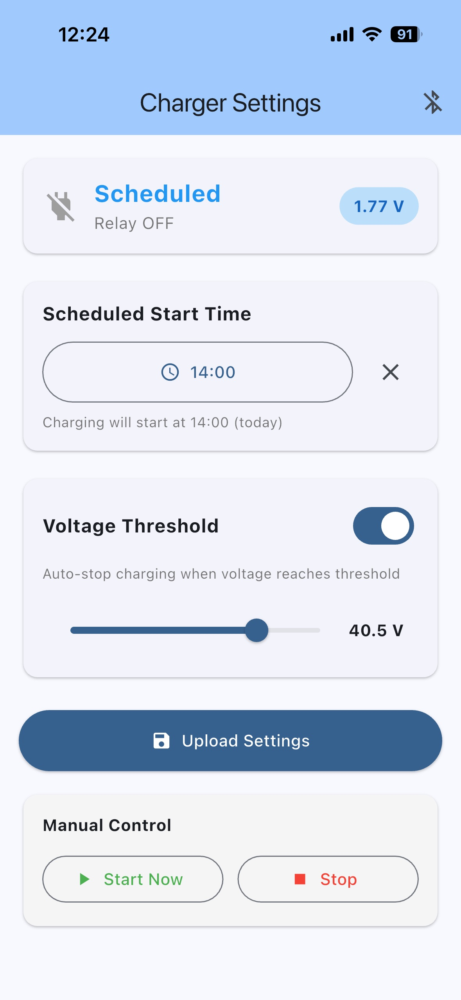

# ESP32-C6 Smart Charger Controller

BLE-controlled charger with scheduled start time and optional automatic voltage-based shutoff.



## Hardware

- **Board**: Seeed Studio XIAO ESP32-C6
- **Relay**: RELAY_GPIO (define in charger_hardware.h) (charger on/off)
- **Voltage ADC**: GPIO 0 (with voltage divider)

## Features

- Schedule charging start time from phone
- Auto-stop at voltage threshold
- Live status updates to phone while connected
- Manual start/stop controls to overwrite schedule

## BLE Protocol

| UUID Suffix | Name     | Properties             |
| ----------- | -------- | ---------------------- |
| `...def0`   | Service  | -                      |
| `...def2`   | Settings | Write (14 bytes)       |
| `...def3`   | Status   | Read/Notify (12 bytes) |
| `...def4`   | Command  | Write (1 byte)         |

Device name: `ESP-CHARGER`

## Building

### ESP32 Firmware

```bash
. ~/esp/esp-idf/export.sh
cd esp-proj
idf.py build
idf.py flash monitor
```

### iOS App

```bash
cd mobile-app
flutter pub get
open ios/Runner.xcworkspace
# Build and run on physical iOS device (BLE requires real hardware)
# then you can later also use
flutter run --release
```

## Configuration

Adjust hardware config according to your circuit in `esp-proj/main/charger_hardware.h`:

```c
#define VOLTAGE_DIVIDER_RATIO 5.0f
#define RELAY_GPIO 15
#define INVERT_RELAY_LOGIC 1  // Set to 1 if relay logic is inverted
```

## Requirements

- ESP-IDF v6.x
- Flutter 3.x
- iOS 13.0+ (physical device)
